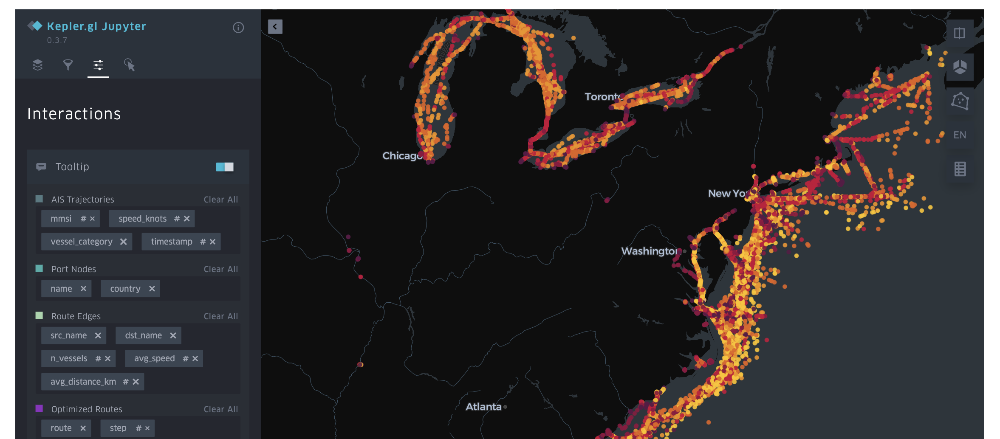

# 🚢 Maritime Route Optimizer

> End-to-end maritime route optimization using real AIS vessel tracking data, Graph Neural Networks, and A* pathfinding.

[](https://www.python.org/)
[](https://pytorch.org/)
[](https://pyg.org/)
[](https://fastapi.tiangolo.com/)
[](LICENSE)



## 🎯 Problem

Given a departure port and a destination port, find the optimal maritime route that minimizes travel time and fuel consumption while avoiding adverse weather conditions and dangerous currents.

## 🏗️ Architecture
```
Real AIS Data (NOAA Marine Cadastre, 2024)
        ↓
  Data Pipeline — cleaning, filtering (76% noise removed)
        ↓
  Feature Engineering — haversine distance, kinematics, temporal
        ↓
  Port Graph — 431 nodes, 1328 edges from 18,524 real vessel routes
        ↓
  Graph Attention Network — dynamic edge cost prediction (MPS + Tesla T4)
        ↓
  A* Pathfinding — optimal route search using GNN costs
        ↓
  FastAPI REST API + Kepler.gl Interactive Map
```

## 📊 Results

| Metric | Local v1 | Colab v3 |
|--------|----------|----------|
| AIS records processed | 21.8M → 1.77M | 35M → 12M |
| Unique vessels | 2,565 | 6,850 |
| Port graph | 67 ports, 63 edges | 431 ports, 1328 edges |
| Routes learned | 506 | 18,524 |
| GNN training loss | 0.022 | 0.019 (Tesla T4) |
| API response time | < 100ms | < 100ms |

## 📦 Stack

| Layer | Technology |
|-------|-----------|
| Data processing | Pandas, GeoPandas, PyArrow |
| ML Model | PyTorch 2.10, PyTorch Geometric 2.7 (GAT) |
| Optimization | Custom A* with GNN-predicted costs |
| API | FastAPI + Uvicorn |
| Visualization | Kepler.gl |

## 📁 Project Structure
```
maritime-route-optimizer/
├── data/
│   ├── raw/          # AIS GeoParquet files (not versioned)
│   ├── processed/    # Cleaned datasets, graph, model
│   └── external/     # World ports reference (NGA/NOAA)
├── notebooks/
│   ├── 01_eda_ais.ipynb               # Exploratory data analysis
│   ├── 02_kepler_visualization.ipynb  # Interactive map (Kepler.gl)
│   └── 03_colab_scaling.ipynb         # Scaling on Google Colab + T4 GPU
├── src/
│   ├── data/
│   │   ├── download.py    # AIS data downloader
│   │   └── pipeline.py    # Cleaning pipeline
│   ├── features/
│   │   └── engineer.py    # Feature engineering
│   ├── models/
│   │   ├── graph_builder.py  # Port graph construction
│   │   ├── gnn.py            # Graph Attention Network
│   │   └── optimizer.py      # A* route optimizer
│   └── api/
│       └── main.py        # FastAPI endpoints
├── app/               # Kepler.gl visualization
├── configs/
│   └── config.yaml    # Project configuration
└── docs/              # Screenshots and assets
```

## 🚀 Getting Started
```bash
# Clone the repo
git clone https://github.com/NaimMG/maritime-route-optimizer.git
cd maritime-route-optimizer

# Create virtual environment
python3 -m venv maritimeoptimizer
source maritimeoptimizer/bin/activate

# Install dependencies
pip install -r requirements.txt
pip install torch torchvision torchaudio
pip install torch-geometric

# Download AIS data (3 days, ~683MB)
python3 src/data/download.py

# Run full pipeline
python3 src/data/pipeline.py
python3 -m src.features.engineer
python3 -m src.models.graph_builder
python3 -m src.models.gnn

# Start API
python3 -m uvicorn src.api.main:app --reload --port 8000
```

## 🔌 API Usage
```bash
# Get all available ports
curl http://localhost:8000/ports

# Optimize a route
curl -X POST http://localhost:8000/optimize \
  -H "Content-Type: application/json" \
  -d '{"origin": "Los Angeles", "destination": "Long Beach"}'
```

**Response:**
```json
{
  "found": true,
  "origin": "Los Angeles",
  "destination": "Long Beach",
  "path": ["Los Angeles", "Long Beach"],
  "total_distance_km": 6.4,
  "total_cost": 0.1676,
  "n_hops": 1
}
```

## 📊 Data

Real **AIS (Automatic Identification System)** data from [NOAA Marine Cadastre](https://marinecadastre.gov/) — the official US Coast Guard vessel tracking system. Data is in GeoParquet format, covering US coastal waters for January, April and July 2024 (45 days, ~10GB).
Scaled training performed on Google Colab with Tesla T4 GPU.

## 🔬 Methodology

1. **EDA** — Explore 7.3M daily AIS messages, identify noise (76% stopped vessels)
2. **Pipeline** — Filter by speed, vessel type, trajectory length
3. **Graph construction** — Detect ports from trajectory endpoints (50km radius)
4. **GNN training** — Graph Attention Network learns dynamic edge costs
5. **Route optimization** — A* search using GNN-predicted costs
6. **Visualization** — Kepler.gl interactive map with 4 data layers

## 👤 Author

**Naim** — [GitHub](https://github.com/NaimMG) · [HuggingFace](https://huggingface.co/Chasston)

---
*Built step by step as a real-world data science portfolio project.*